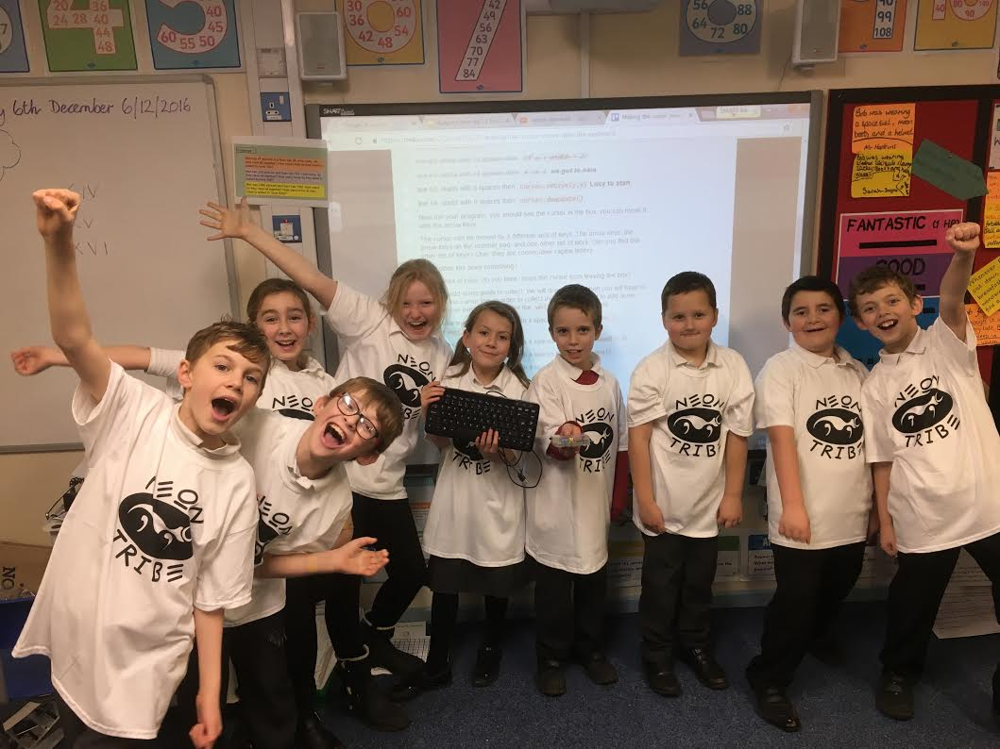

Earlier in the year we offered to help out at a primary school in Bacton, Norfolk, who were already running a python based coding club of their own.

Instead of just allowing the club to "drag and drop" predetermined calls to action using Scratch, we started properly 'from scratch' by using a raspberry pi, some bits of kit and a [Trello board](https://trello.com/invite/b/l7JJOGH0/dc390ec2ab9c7686c899c658d315e0a2/computer-club) to set up a game for the kids to code themselves.

They learnt to work as a team, reading the code to each other whilst simultaneously keying it in. Trello was used to host all of the actions and questions, as work tickets.

The group soon grasped the concept and really took to it, firing some great questions at us as we progressed to a finish point, with the big learning curve being the recursive division method.

We witnessed confidence levels amongst the group growing each week and this led to interaction and keyboard skills improving during regular school time too.

Attention to detail and "exactness" were also key to the group with differentiating between curly brackets and round brackets being strong talking points, also "the hungry crocodile" and # not hashtags providing a constant stream of banter/wit/giggling amongst them.

We received some favourable feedback and have been asked to go back next year for some more fun.

Here's what they said....

> "....'Neil, Karl and George from Neontribe have been fantastic! Their skills, knowledge and enthusiasm have been infectious! As a school we encourage our children to learn how to use computers safely but in modern life it is more and more important to be able, not only to use technology, but to build it and the children at coding club are well on their way to being coders of the future. The children's typing speed have increased and their knowledge of the language of code has been very impressive. We are already looking forward to another successful coding club next year"....

We'll go again, we think they're alright........
