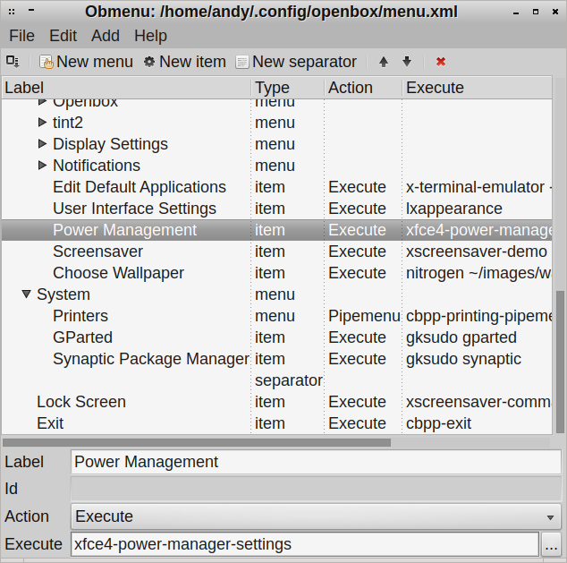
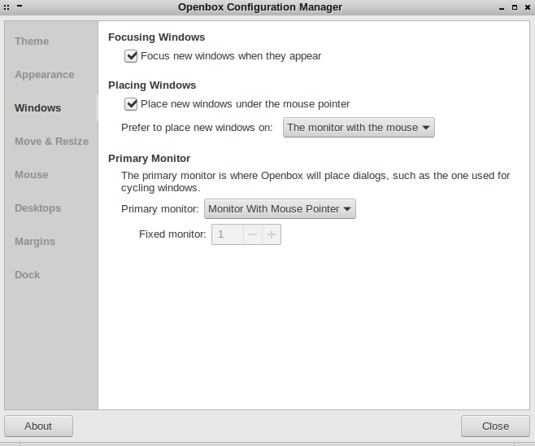
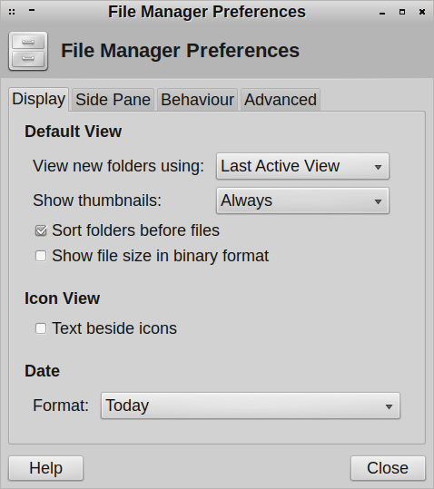

**Crunchbangplusplus 9**

[Crunchbangplusplus (#!++)](https://crunchbangplusplus.org/) has been my workstation distribution of choice ever since [Crunchbang (#!)](https://debian.org/) shut down. The original Crunchbang distribution was fairly lightweight and used Openbox. Once it shut down [@computermouth](https://twitter.com/computermouth) created a homage in Crunchbangplusplus.

Crunchbangplusplus 9 is based on [Debian](https://www.debian.org/) 9 Stable (Stretch).

**Issues**

Crunchbangplusplus 9 shipped with some configuration issues.

- OBApps package missing
- Power Management menu entry mis-configured
- Volume Control keyboard shortcut mis-configured
- Default `new window` behavior
- File Manager image previews disabled
- GIMP font rendering incorrect on white text

**OBApps**

The right click menu entry for `Settings > Openbox > Gui Applications Settings Editor` (obapps) fails because it's missing from the installer.

First, we need to install some dependencies.

```
$ sudo apt install python-wxgtk3.0 python-wxtools python-wxversion python-xlib
```

Then retrieve and install the missing obapps package.

```
$ wget http://packages.crunchbangplusplus.org/jessie/pool/main/o/obapps/obapps_0.1.7_all.deb
$ sudo dpkg -i obapps_0.1.7_all.deb
```

**Power Manager**

There is an incorrect menu entry for `Settings > Power Managment`, to fix the menu entry, select `Settings > Openbox > GUI Menu Editor` and change the `Settings > Power Management` entry from `mate-power-manager` to `xfce4-power-manager-settings`, once done you should select `File > Save` to ensure the change is persistent.



**Openbox Configuration Manager**

Using multiple monitors I prefer applications to start on the screen I launch them from. This is not fool-proof but is the best I have been able to manage.

Go to `Settings > Openbox > Gui Config Tool` and on the `Windows` tab put a tick in the `Place new windows under the mouse pointer` checkbox. Also you can select your preference in the `Prefer to place new windows on` and `Primary monitor` dropdown.



**File Manager Previews**

In the file manager Thunar, select from the menu `Edit > Preferences > Show thumbnails: Always` (it defaults to never) and click `close`.



That will fix image and pdf previews, if you would also like video and other media to use preview images you will also need to install an additional package:

```
$ sudo apt install tumbler-plugins-extra
```

**Volume Control**

The `Super + V` key should open the volume control but instead gives the error `failed to execute child process "pavucontrol"`.

To fix this `settings > openbox > edit rc.xml` then replace `pavucontrol` with `mate-volume-control` in the below section `<keybind key="W-v">`.

```
    <keybind key="W-v">
      <action name="Execute">
        <startupnotify>
          <enabled>true</enabled>
          <name>Volume</name>
        </startupnotify>
        <command>mate-volume-control</command>
      </action>
```

I had to reboot before the change took effect.

**GIMP font rendering**

There are some issues with font rendering when placing white text on a black background. These can be fixed by creating `/etc/gimp/2.0/fonts.conf` and adding:

```
<fontconfig>
  <match target="font">
    <edit name="rgba" mode="assign">
      <const>none</const>
    </edit>
  </match>
</fontconfig>
```

**References:**

- [Debian](https://www.debian.org/)
- [Crunchbangplusplus 9](https://crunchbangplusplus.org/)
- [/r/crunchbangplusplus](https://www.reddit.com/r/crunchbangplusplus)
- [Reddit: Missing obapps & mate-power-management](https://www.reddit.com/r/crunchbangplusplus/comments/6v2mg2/missing_obapps_matepowermanagement/)
- [Reddit: Failed to execute child process "pavucontrol"](https://www.reddit.com/r/crunchbangplusplus/comments/8oach1/obapps_and_matepowermanagement_corrected_but_iv/)
- [Superuser: Why is Thunar not creating and showing thumbnails of images?](https://superuser.com/questions/258633/why-is-thunar-not-creating-and-showing-thumbnails-of-images)
- [GitHub: Font Rendering GIMP 2.8](https://github.com/CBPP/cbpp/issues/31)
