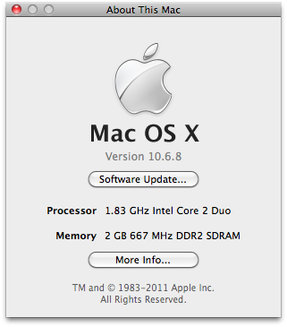
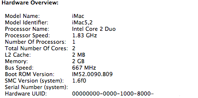
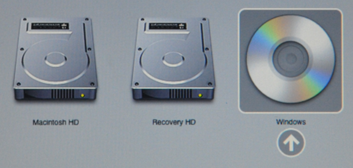

I have just retired an old iMac from our browser testing lab due to age, the model is an iMac 5,2 with 2GB memory and Core 2 Duo 1.83 Ghz processor.

It runs 10.6.8 (Snow Leopard) quite well, but 10.7.4 (Lion) runs like a dog. Neither Snow Leopard nor Lion are getting updates any time soon and I wanted to make it useful again so I am re-purposing it with a Linux install.





I like to use [Crunchbangplusplus](https://crunchbangplusplus.org/) (#!++) as it's a nice low weight Debian based distribution and runs well in low footprint virtual machines.

Initially I tried to install a 64-bit version of #!++ however even though the CPU is 64-bit the EFI firmware of these old Macs is 32-bit and won't boot the 64-bit ISO.

Below is the method I used for a successful installation of the i386 ISO.

The #!++ installer is a modified Debian net install image so you will require a working network connection (more on this later).

Download the [crunchbangplusplus i386 ISO](https://crunchbangplusplus.org/assets/misc/cbpp-1.0-i386-20150428.iso.torrent) and then dd it onto a USB stick or burn the ISO image onto a blank disk (check the drive type as our iMac only has a CDROM). I went the USB stick route.

To discover the the device path the to USB stick I inserted it into a USB port on my Linux workstation and then ran dmesg to see the device path it had mounted.

```
# dmesg
[92951.649402] usb 2-2: new SuperSpeed USB device number 2 using xhci_hcd
[92951.665804] usb 2-2: New USB device found, idVendor=1b1c, idProduct=1a03
[92951.665806] usb 2-2: New USB device strings: Mfr=1, Product=2, SerialNumber=3
[92951.665807] usb 2-2: Product: Voyager 3.0
[92951.665808] usb 2-2: Manufacturer: Corsair
[92951.665809] usb 2-2: SerialNumber: 23010411150000030338
[92951.672381] usb-storage 2-2:1.0: USB Mass Storage device detected
[92951.672420] scsi host8: usb-storage 2-2:1.0
[92951.672699] usbcore: registered new interface driver usb-storage
[92951.673693] usbcore: registered new interface driver uas
[92952.671824] scsi 8:0:0:0: Direct-Access     Corsair  Voyager 3.0      1.00 PQ: 0 ANSI: 4
[92952.672020] sd 8:0:0:0: Attached scsi generic sg1 type 0
[92952.672227] sd 8:0:0:0: [sdb] 31334400 512-byte logical blocks: (16.0 GB/14.9 GiB)
[92952.672331] sd 8:0:0:0: [sdb] Write Protect is off
[92952.672333] sd 8:0:0:0: [sdb] Mode Sense: bf 00 00 00
[92952.672475] sd 8:0:0:0: [sdb] Write cache: disabled, read cache: enabled, doesn't support DPO or FUA
[92952.679541]  sdb: sdb1 sdb2 sdb3 sdb4
[92952.680350] sd 8:0:0:0: [sdb] Attached SCSI removable disk
```

I can see from the dmesg output that the new USB device is /dev/sdb, next we want to dd the iso image onto the device.

```
# dd if=cbpp-1.0-i386-20150428.iso of=/dev/sdb bs=4M; sync
```

Where cbpp-1.0-i386-20150428.iso is the full path to the #!++ ISO and /dev/sdb is the full path to the USB device we identified in dmesg.

The sync command ensures that all the changes are written to the usb before we eject.

Eject the usb stick as it is now ready and place it in one of the USB ports on the back of the iMac.

Power on the iMac and at the chime press and hold option/alt key (depending if you have apple/normal keyboard attached) and you will arrive at the EFI boot manager.



Select the EFI USB stick you have just prepared to boot from, even though it was a #!++ image dd'd onto a USB stick it still showed up in the apple boot manager as "windows".

The rest of the installation should proceed as normal. I used a network cable into the iMac and it worked out of the box, however if you require working wifi to complete the installation then you can manually put the non-free firmware files onto a USB stick for use during the install.

```
The missing firmware files are
b43/ucode5.fw
b43/ucode5.fw
b43-open/ucode5.fw
b43-open/ucode5.fw
If you have such media available now insert it now and continue.
```

**Post install**  
First I ran through the #!++ helper script and let it upgrade my system and install some packages. Once that was finished I went about getting the wifi working.

To configure the wifi card I ran the firmware installer:

```
# apt-get install firmware-b43-installer; reboot
```

To get the iSight camera working you need to [Download AppleUSBVideoSupport](http://dalmano.bplaced.net/turanct.zym.backup/AUVideoS.zip) into a folder.

```
# unzip AUVideoS.zip
# apt-get install isight-firmware-tools
no when it prompts to unpack
# ift-extract --apple-driver AppleUSBVideoSupport
```

There are a few other minor changes we can make like this [grub fix](https://bbs.archlinux.org/viewtopic.php?id=138901).

```
# apt-get install vim
# vim /etc/default/grub
GRUB_CMDLINE_LINUX_DEFAULT="quiet, noefi"
# update-grub; reboot
```

Also the [i8042 fix](http://unix.stackexchange.com/questions/28736/what-does-the-i8042-nomux-1-kernel-option-do-during-booting-of-ubuntu).

```
$ dmesg | grep i8042
[    0.915119] i8042: PNP: No PS/2 controller found. Probing ports directly.
[    1.937749] i8042: No controller found
```

References:

- [crunchbangplusplus](https://crunchbangplusplus.org/)
- [debian forum](http://forums.debian.net/viewtopic.php?f=17&t=122273)
- [ubuntu forum](http://ubuntuforums.org/showthread.php?t=2239022&page=4&p=13119224#post13119224)
- [ifixit Hard Drive Replacement](https://www.ifixit.com/Guide/iMac+Intel+17-Inch+Hard+Drive+Replacement/891)
- [driver wiki page](https://wireless.wiki.kernel.org/en/users/Drivers/b43)
