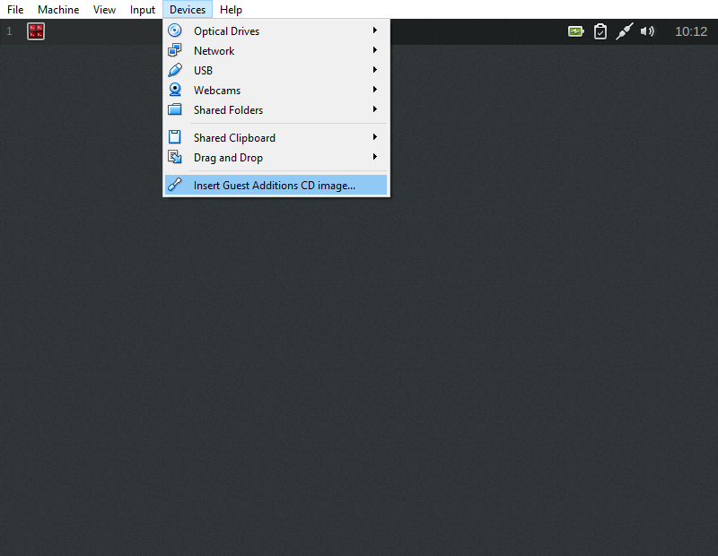

I discovered recently that VirtualBox is no longer in the Debian official repositories, which prevents us from installing the Guest Additions from the package manager (apt).

The Guest Additions provide the drivers for the virtual hardware in a VirtualBox guest.

Installing the Guest Additions is still relatively straight forward however.

```
$ sudo apt update
$ sudo apt install build-essential module-assistant dkms
$ sudo m-a prepare
```

From the Virtualbox menu select "Devices > Insert Guest Additions CD image.." and after a few moments a dialog should appear prompting you to install the additions.


Select "Run" and let the installation proceed. If you have autorun disabled or the dialog does not appear you can manually start it:

```
$ sudo sh /media/cdrom/VBoxLinuxAdditions.run
Verifying archive integrity... All good.
Uncompressing VirtualBox 5.1.28 Guest Additions for Linux...........
VirtualBox Guest Additions installer
Copying additional installer modules ...
vboxadd.sh Starting the VirtualBox Guest Additions.
$ sudo reboot
```

Finally reboot the machine.

**References**

- [VirtualBox](https://www.virtualbox.org/wiki/Downloads)
