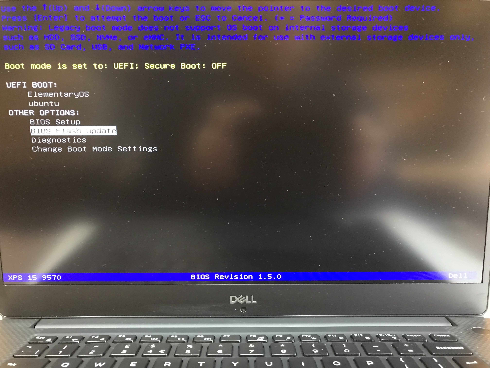
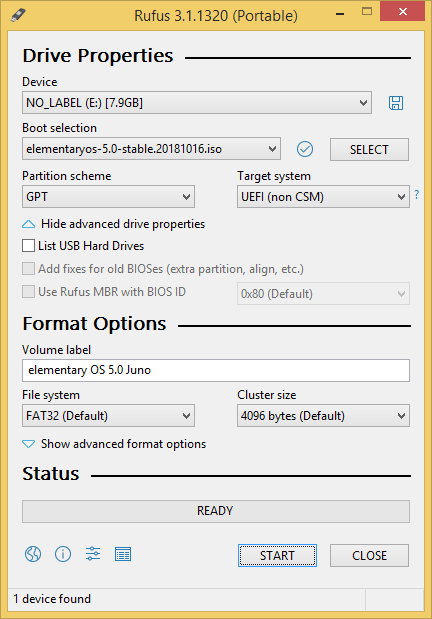
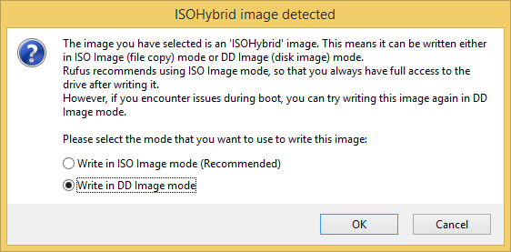

**Preperation**

We need to update the BIOS to the latest version, make some changes to the BIOS configuration and we need to flash a USB installer with the latest version of Elementary OS (more on that later).

We will need a USB stick with at least 2GiB of space.

**BIOS**

I updated the BIOS to [1.5.0](https://downloads.dell.com/FOLDER05186541M/1/XPS_9570_01_05_00.exe) (the latest version currently available). I formatted a USB stick to FAT32 and put the BIOS update executable onto the USB stick. Then while powering on the laptop, I pressed F12 to access the boot menu and chose the option BIOS Flash Update - which allowed me to select the XPS_9570_01_05_00.EXE and apply it without having to boot into Windows.

In the Dell XPS BIOS (accessed with F2 at startup) I set the following options.

- General > Boot Sequence > Boot List Option > check UEFI
- System Configuration > SATA Operation > check AHCI
- Secure Boot > Secure Boot Enable > uncheck Secure Boot Enable
- Secure Boot > Disable

**USB Installer**

I created a bootable USB installer using [Rufus](https://rufus.ie/) with [ElementaryOS](https://elementary.io/) (5.0 Juno).

Whilst creating the USB in Rufus, I used GPT/UEFI mode and wrote the image in "DD" image mode.

You may be able to use [Etcher](https://etcher.io/) on a Linux system in place of Rufus.

**Installation**

I had to write the USB installer in DD mode with Rufus. I was only able to get the Dell XPS 15 to boot from a USB stick in the left-hand USB port!

At power on F2 will access the BIOS settings, whilst F12 will provide you with a one-time boot menu.

The Elementary OS installation was performed as usual from this point onward, creating user accounts and encrypting the disk.

References:

- [GitHub: Dell XPS 9570 Ubuntu Respin](https://github.com/JackHack96/dell-xps-9570-ubuntu-respin)
- [Ask Ubuntu: Trying to install Ubuntu on Dell XPS 15 (9570)](https://askubuntu.com/questions/1042414/trying-to-install-ubuntu-on-dell-xps-15-9570)
- [Dell Frequently Asked Questions](https://www.dell.com/support/article/uk/en/ukdhs1/sln290665/ubuntu-frequently-asked-questions?lang=en)
- [Elementary OS](https://elementary.io/)
- [Etcher](https://etcher.io/)
- [Ubuntu Linux on Dell XPS 15 (9560)](<https://github.com/rcasero/doc/wiki/Ubuntu-linux-on-Dell-XPS-15-(9560)>)
- [Dell XPS 1555 (9570) and Ubuntu](https://www.dell.com/community/Linux-General/XPS-15-9570-and-Ubuntu/td-p/6096817)
- [How to nomodeset](https://ubuntuforums.org/showthread.php?t=1613132)
- [How to turn off ACPI](http://ubuntuguide.net/turn-off-acpi-ubuntu-grub2)
- [Reddit: Install problems on Dell XPS 15 (9560)](https://www.reddit.com/r/elementaryos/comments/6ut5i5/install_problems_on_dell_xps_15_9560/)
- [Arch Linux Wiki page for Dell XPS 15 (9560)](https://wiki.archlinux.org/index.php/Dell_XPS_15_9560)
