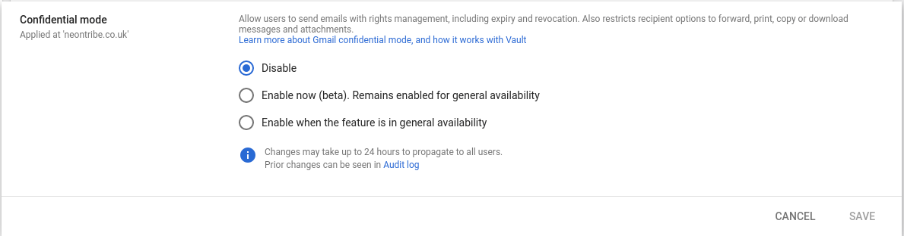
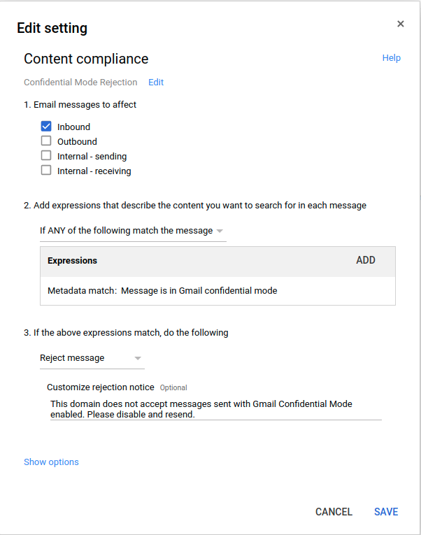
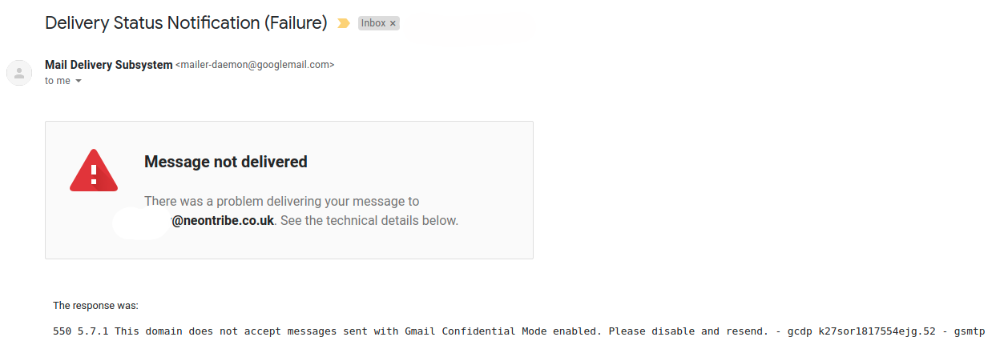

## What

There has already been a [lot](https://www.computerworld.com/article/3272247/watch-out-for-gmail-s-new-confidential-mode.html) [of](https://yro.slashdot.org/story/19/05/29/2240231/gmails-confidential-mode-will-be-on-by-default-for-g-suite-users-starting-june-25th) [discussion](https://gsuiteupdates.googleblog.com/2019/05/gmail-confidential-mode-launching-on-by.html) on Gmail's confidential mode, now it's rolling out for business customers I'm going to show you how to disable it for both incoming and outgoing email.

## Why

As it would be almost impossible to comply with data retention laws.

The Financial Conduct Authority require the financial sector to retain emails for six years.

In the UK, the Civil Procedure rules allow a breach of contract claim within six years and also requires companies to be ready for discovery (including emails).

We're taking both of the above as worthy of serious consideration. Apart from being a distasteful power grab by Google, email is fragile enough without mail history going missing or being subject to a gatekeeper.

## How

### Disabling Confidential Mode outbound mail

Log into the [Admin Console](https://gsuite.google.com/) for your domain.

- Choose `Apps -> G Suite -> Gmail -> User Settings`
- Under `Confidential Mode` select `Disabled` and save.

### Rejecting Confidential Mode inbound mail

From the [Admin Console](https://gsuite.google.com/) for your domain:

- Choose `Apps -> G Suite -> Gmail -> Advanced Settings -> Content compliance`
- Add policy:
  _ `Name: Confidential Mode Rejection`
  _ `Email messages to affect: Inbound`
  _ `Add expressions that describe the content you want to search for in each message: If ANY of the following match the message` and add the following expression:
  _ `Type: Metadata match`
  _ `Attribute: Gmail confidential mode`
  _ `Match type: Message is in Gmail confidential mode`
  _ Save the expression
  _ `If the above expressions match, do the following: Reject message` \* `Customize rejection notice: This domain does not accept messages sent with Gmail Confidential Mode enabled. Please disable and resend.`

### Testing

Once you have configured all the above, you'll want to test it's working. From a non business Gmail account, send a confidential mode email to one of your users. You should get a mail rejection.

### Ramifications

We accept the policy we've made may make it difficult for partners to communicate if they accept or don't know about Google's default "on" position, but we hope to raise their awareness of it.

### References

- [Avoiding Gmail's confidential mode](https://pgsnake.blogspot.com/2019/05/avoiding-gmails-confidential-mode.html)
- [Watch out for Gmail’s new Confidential Mode](https://www.computerworld.com/article/3272247/watch-out-for-gmail-s-new-confidential-mode.html)
- [Your guide to email archiving under UK law](https://www.solarwindsmsp.com/blog/your-guide-to-email-archiving-under-uk-law)
