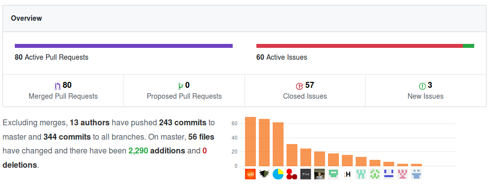
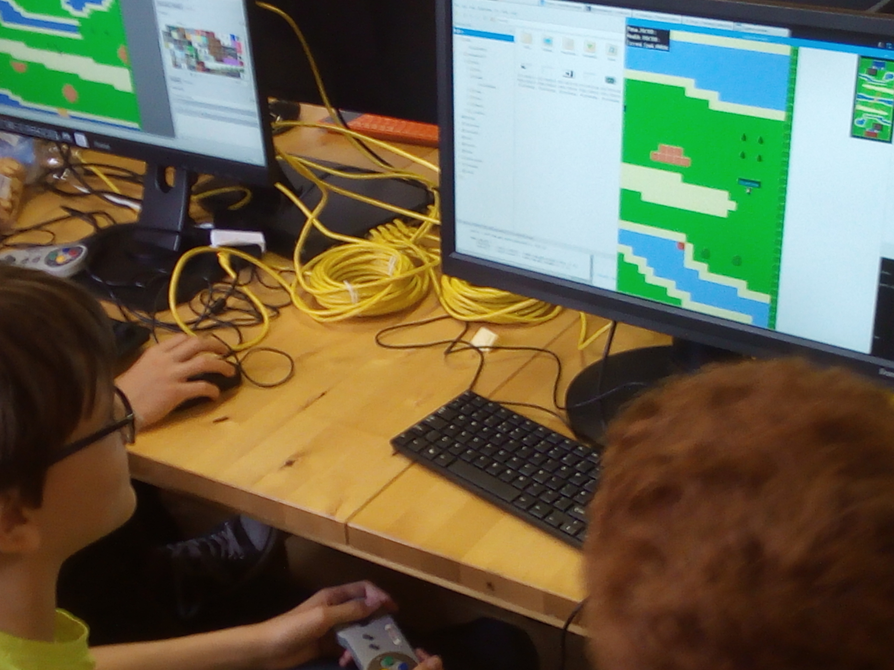

Untangled is about learning but not just for the young people. In the week of the event I learnt more mentoring the enthusiastic youth of Norwich than during any week of my university life.

This year the mentors’ job was simple: create the base game for Untangled before the event, then manage and assist the young people with adding suggested features during the week.

The mentors consisted of Neontribers and local game developers wanting to give back to the local community.

By performing the trivial framework tasks such as implementing the network capabilities and creating the default map beforehand it allowed the week to be more productive, with no long delays in development and letting the young people begin making new features immediately.

The difference between the [base game](https://github.com/Stansbridge/untangled-2017) and the [result of Untangled 2017](https://github.com/neontribe/untangled-2017) is astounding.

During the week the mentors were the young people’s guide, teaching them the basics of software development and then assisting them with any problems that arose. We would always guide them in a constructive direction, without solving the problem outright. This allowed the participants of the event to overcome obstacles themselves.

My advice for future mentors of Untangled is to mimic 2017’s model, and have a solid base for the young people to work from. Untangled is chaotic by nature, so having this head start is beneficial for everyone.

There weren’t many negatives with this year's Untangled, everyone made progress as a software developer and the final result was a fully functional game. Some minor things I would suggest in the future would be to have control over the Pis (or whatever machine). Being able to lock everyone's screen for example would make communicating as a group much easier, with fewer distractions.

One of the most important skills in industry is the ability to work as part of a team, and this is especially relevant in software development. The current education system doesn’t emphasise this enough, with most schools teaching students how to create systems by themselves and rarely giving them the opportunity to work in larger teams. This makes events like Untangled even more important.

My final thoughts, as a mentor of Untangled 2017, are of satisfaction and relief. The week ran as smooth as any event such as this could, and with a successful result. Everyone learnt something, even the mentors, with teaching being the best way to learn.

I encourage anyone interested in this industry to get involved with Untangled or a similar event. Whether it be to take part, wanting to mentor or just wanting to see what all the fuss is about, it will be an invaluable experience for you.

I hope to see you at the next Untangled and maybe you'll have as much fun as George did!

####Get involved:

- [Sync Norwich](https://www.meetup.com/syncnorwich/)
- [Science and Tech Events](https://www.eventbrite.co.uk/d/england--norwich/science-and-tech--events/)
