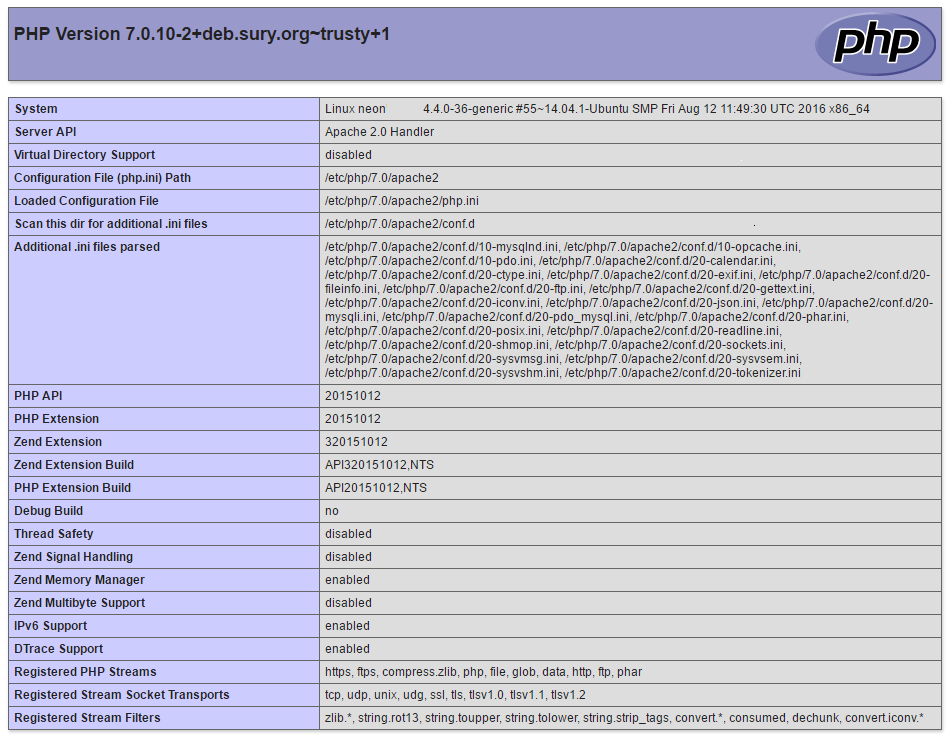

**Installation**

Ubuntu 14.04 Server ships with php 5.5.9-1 and it was desirable for our developers to use a newer version.

Rather than compiling from source we are going to use a [backport of php7.0](https://launchpad.net/~ondrej/+archive/ubuntu/php) from Ubuntu 16.04 provided by [Ondřej Surý](https://launchpad.net/~ondrej).

```
$ sudo add-apt-repository ppa:ondrej/php
```

Due to a current bug if your system locale is set to anything other than UTF-8 we need to use the following workaround to allow us to add the PPA.

```
$ sudo apt-get install -y language-pack-en-base
$ sudo LC_ALL=en_US.UTF-8 add-apt-repository ppa:ondrej/php
$ sudo apt-get update
```

Install the php package.

```
$ sudo apt-get update
$ sudo apt-get install php7.0
```

Install any php modules your project may need.

```
$ sudo apt-get install php7.0-mysql php-xml php7.0-zip php-sqlite3 php-mbstring php7.0-curl php7.0-intl
```

The installation of _php7.0-mysql_ will also remove _php5-mysql_ (which should be noted in case you wish to roll back later).

**Testing**

We can check and set the version of the php interpreter that is used by the command line.

```
$ sudo update-alternatives --list php
/usr/bin/php5
/usr/bin/php7.0
```

We can then set the default command line interpreter using _update-alternatives_.

```
$ sudo update-alternatives --set php /usr/bin/php5
$ sudo update-alternatives --set php /usr/bin/php7.0
```

We can also run a script on a specific version of the php runtime by specifying the interpreter on the command line _/path/to/desired/php/interpreter /path/to/your/script_.

```
$ /usr/bin/php5 /home/andy/myscript.php
```

We can check the default version of php that is running on the command line as follows.

```
$ php -v
PHP 7.0.10-2+deb.sury.org~trusty+1 (cli) ( NTS )
Copyright (c) 1997-2016 The PHP Group
Zend Engine v3.0.0, Copyright (c) 1998-2016 Zend Technologies
    with Zend OPcache v7.0.10-2+deb.sury.org~trusty+1, Copyright (c) 1999-2016, by Zend Technologies
```

We can also check the version of php that is running on the webserver by creating _/path/to/webserver/root/info.php_.

```
info.php
<?php
phpinfo();
?>
```

**Modules**

You will need to disabled the Apache PHP5 module and enabled the PHP7.0 module.

```
$ sudo a2dismod php5
$ sudo a2enmod php7.0
$ sudo service apache2 restart
```

You can test by hitting _< your domain>/info.php_ and you should see the info.php page.



For added security the info.php file should be removed once testing is completed.

```
$ sudo rm /path/to/webserver/root/info.php
```

**Removal**

If everything goes wrong and you want to remove php7.0 and revert back to the 5.5.9-1 version supplied with Ubuntu 14.04 Server you can perform the following operation.

```
$ sudo apt-get remove php7.0 php7.0-cliphp7.0-mysql php7.0-common php7.0-json php7.0-opcache \
php7.0-readline php7.0-xml php7.0-zip php-sqlite3 php-mbstring --purge
$ sudo rm /etc/apt/sources.list.d/ondrej-php-trusty.list.save
$ sudo rm /etc/apt/sources.list.d/ondrej-php-trusty.list
$ sudo apt-get update
```

If you use mysql don't forget to re-install the php5-mysql package.

```
$ sudo apt-get install php5-mysql
```

Also re-enabled php5 Apache module.

```
$ sudo a2dismod php7.0
$ sudo a2enmod php5
$ sudo service apache2 restart
```

**References**

- [digitalocean how to upgrade to php 7 on ubuntu 14.04](https://www.digitalocean.com/community/tutorials/how-to-upgrade-to-php-7-on-ubuntu-14-04)
- [askubuntu how to have two versions of phpinstalled and switch easily](http://askubuntu.com/questions/50344/how-to-have-two-version-of-php-installed-and-switch-easily)
- [serverfault multiple php versions simultaneously on ubuntu](http://serverfault.com/questions/431875/multiple-php-versions-simultaneously-on-ubuntu)
- [reverting php cli back to default path on ubuntu nginx hhvm](http://serverfault.com/questions/698738/reverting-php-cli-back-to-default-path-on-ubuntu-nginx-hhvm)
- [which php mode apache vs cgi vs fastgci](http://blog.layershift.com/which-php-mode-apache-vs-cgi-vs-fastcgi/)
- [how do i install the dom extension for php7](https://laracasts.com/discuss/channels/servers/how-do-i-install-the-dom-extension-for-php7)
- [laravel backup issue 76](https://github.com/spatie/laravel-backup/issues/76)
