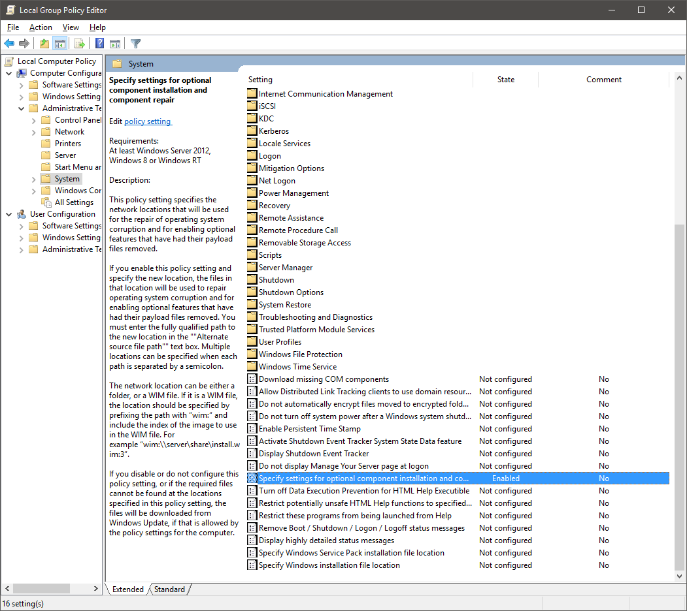
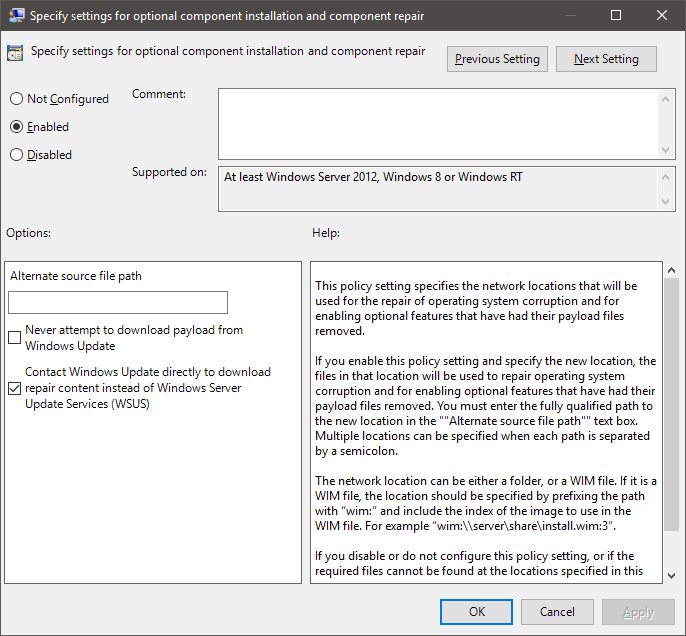

**Anniversary Update**

On 2nd August the Windows 10 Anniversary Update began rolling out. Primarily of interest to Neontribe is the [integrated Bash that we looked at during the Insider Preview](https://www.neontribe.co.uk/howto-bash-windows-10/).

Whilst it should arrive for everyone care of Windows Update over the coming weeks there are several methods you can use to speed up receiving the update.

**Forcing Upgrade**

- [Media Creation Tool](https://www.microsoft.com/en-gb/software-download/windows10)  
  The Media Creation Tool is the official method of downloading the ISO images and burning a DVD or creating a USB installer.
- [Refresh Windows Tool](https://www.microsoft.com/en-us/software-download/windows10startfresh)  
  The Refresh Windows Tool is the offical method of forcing an Anniversary Update installation onto a machine.

Neither of these options are working reliably for me at present. This could be due to the burden on the Microsoft Update servers or it could be caused by issues with the local Windows Update service. We can't do anything about the first, so lets take a look at the problems we can fix in the Windows Update service.

**Troubleshooting**

Check group policy settings in the Group Policy Editor.

```
Start > type "group policy" > select "Edit Group Policy"
```



Navigate to "Local Configuration > Administrative Templates > System > Specify settings for optional component installation and component repair".



Ensure that "Enabled" is checked and that "Contact Windows Update directly to download repair content instead of Windows Server Update Services (WSUS)" is checked.

Open the command prompt as an administrator.

```
Start > type "cmd" > right click and select "Run as administrator"
```


Begin a system scan with System File Checker (SFC).

```
c:\>sfc /scannow

Beginning system scan.  This process will take some time.

Beginning verification phase of system scan.
Verification 100% complete.
```

If the System File Checker is unable to resolve the issue, next up we try the Deployment Imaging and Servicing Management (DISM) tool.

```
c:\>Dism /online /Cleanup-Image /StartComponentCleanup
Deployment Image Servicing and Managment tool
Version: 10.0.10586.0
[==========================100%=========================]
The operation completed successfully.
```

```
c:\>Dism /Online /Cleanup-Image /RestoreHealth
Deployment Image Servicing and Managment tool
Version: 10.0.10586.0

Image Version: 10.0.10586.0
[==========================100%=========================]
The operation completed successfully.
```

If, like for one of my systems, the official Media Creation Tool and Refresh Windows Tool continue to fail at this stage we must resort to either an installation DVD or USB.

**Download ISO and Upgrade/Reinstall**

I was unable to use the Media Creation Tool to download the official ISO image, presumably their update service is having a bad day.

I downloaded the [Windows 10 (1607) ISO](http://windowsiso.net/windows-10-iso/windows-10-anniversary-update-1607-download-build-14393-0/windows-10-anniversary-update-1607-iso-download-standard/) and performed an upgrade by running setup from the DVD.

Once you have downloaded the ISO image you should check that it has not been tampered with. The SHA1 for Microsoft Windows 10 English International x64 is ([sourced from Microsoft](https://msdn.microsoft.com/subscriptions/securedownloads/?#searchTerm=Windows 10 (Multiple Editions), Version 1607&ProductFamilyId=0&Languages=en&PageSize=10&PageIndex=0&FileId=0)):

```
47D274A604E38B8B80B47630BEAA8FFCC7D2980D.
```

Download the Microsoft md5sum utility [Windows-KB841290-x86-ENU.exe](https://www.microsoft.com/en-gb/download/details.aspx?id=11533).

When you run it you will be asked to select a folder to extract the command line utility into. It will make your life easier if you select the same folder that you have downloaded the ISO for Windows 10 into.

```
c:\> fciv -sha1 c:\Users\andy\Downloads\Win10_1607_EnglishInternational_x64.iso
//
// File Checksum Integrity Verifier version 2.05.
//
47D274A604E38B8B80B47630BEAA8FFCC7D2980D c:\Users\andy\Downloads\Win10_1607_EnglishInternational_x64.iso
```

You can now either burn a DVD and run a live upgrade from your installation media, or you can burn a USB key with the installer on (for which I recommend [Rufus](https://rufus.akeo.ie/)).

**References**

- [Windows 10 (1607) ISO Download](http://windowsiso.net/windows-10-iso/windows-10-anniversary-update-1607-download-build-14393-0/windows-10-anniversary-update-1607-iso-download-standard/)
- [Media Creation Tool](https://l.facebook.com/l.php?u=https%3A%2F%2Fwww.microsoft.com%2Fen-gb%2Fsoftware-download%2Fwindows10&h=PAQFZGHEV)
- [Refresh Windows Tool](https://l.facebook.com/l.php?u=https%3A%2F%2Fwww.microsoft.com%2Fen-us%2Fsoftware-download%2Fwindows10startfresh&h=0AQEuhubD)
- [Windows 10 Anniversary Update Megathread](https://www.reddit.com/r/Windows10/comments/4vrr27/windows_10_anniversary_update_megathread/)
- [DSIM source files could not be found when trying to repair](http://www.eightforums.com/performance-maintenance/58764-dism-source-files-could-not-befound-when-trying-restore.html)
- [How to get the Windows 10 Anniversary Update](https://blogs.windows.com/windowsexperience/2016/08/02/how-to-get-the-windows-10-anniversary-update/)
