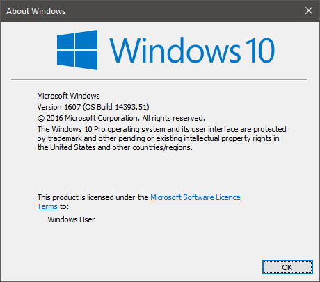
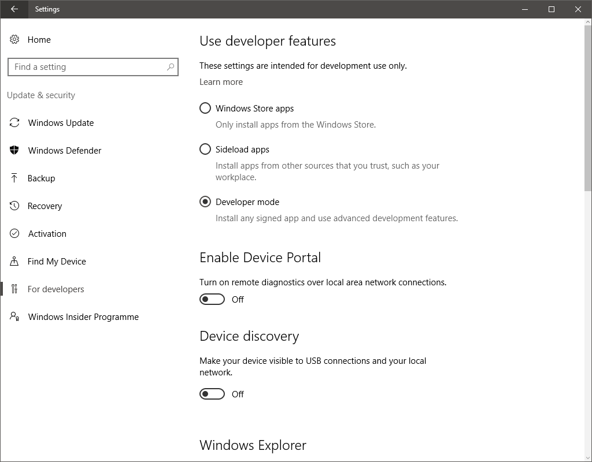
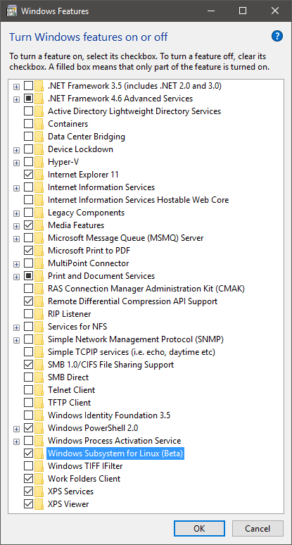
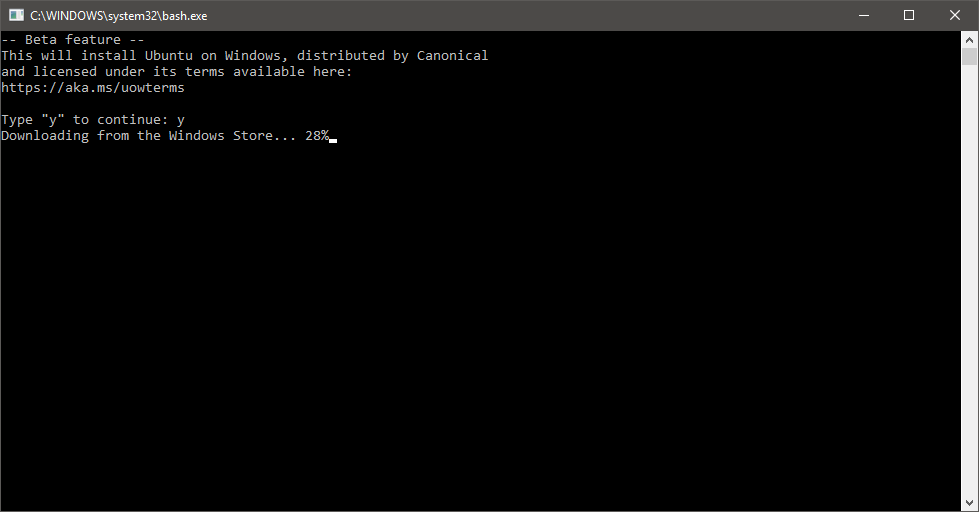
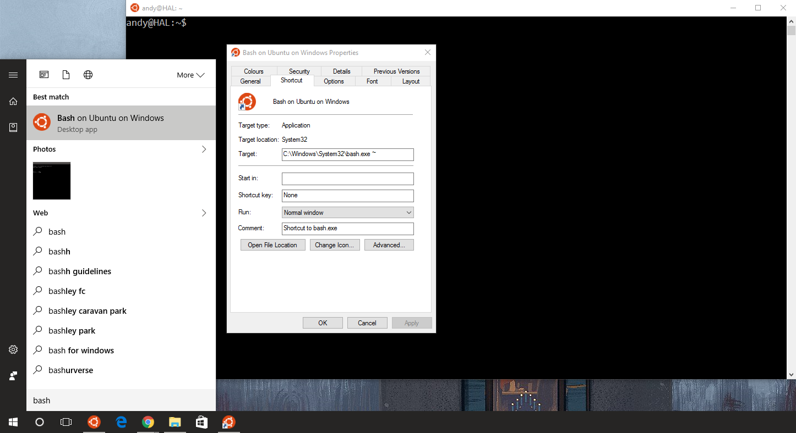
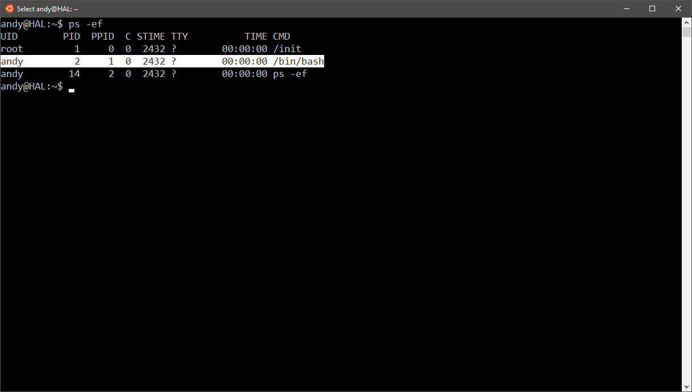

Since the [release of Windows 10 anniversary update](https://www.neontribe.co.uk/windows-10-anniversary-update-1607/) the new integrated Bash is available, but requires a little bit of tweaking under the hood to get working.

You must be running the new anniversary update before this is available to install, so lets check by clicking `Start > winver` and ensuring you have Version 1607 (OS Build 14393.51) or higher installed.



**Installation**

First we need to enable developer mode by clicking `Start > Settings > Update & Security > For Developers and tick "Developer mode"`.


Next we need to add the Windows Subsystem for Linux by clicking `Start > type "Turn Windows features on or off" > tick "Windows Subsystem for Linux (Beta)`



This feature will require a restart of your computer.

Now open a command prompt `Start > type "cmd" and in the Command Prompt window type "bash"`.



You can now launch and pin the "Bash" application to you taskbar.



**Copy/Paste**

The copy paste functionality of the new Windows 10 command prompt means you can use ctrl+c to copy and ctrl+v to paste like full Windows applications. This functionality is not carried over to the integrated Bash.

To copy just left click and drag a selection as though you were using a word processor, once you are satisfied with your selection right click to commit it to the copy buffer (this should clear the selection as confirmation)



To paste a selection you just right click the mouse a second time.

_Alternatively ctrl+insert and ctrl+shift+insert is supposed to work but I can't confirm as I was unable to use this combination._

**Troubleshooting**

Currently the network stack doesn't support ICMP unless you run the Bash shell as an administrator.

```
$ ping 127.0.0.1
ping: icmp open socket: Permission denied
```

Microsoft are working to resolve this issue, however you can right click the Bash icon and select "run as Administrator" to work around the issue.

**References**

- [Windows 10 build 14316: ctrl + v doesn't work on Bash ](http://superuser.com/questions/1064813/windows-10-build-14316-ctrl-v-doesnt-work-on-bash-on-ubuntu-on-windows)
- [What's new in the Windows Console](https://technet.microsoft.com/en-us/library/mt427362.aspx)
- [Microsoft BashOnWindows Issue #18 Ping is not working](https://github.com/Microsoft/BashOnWindows/issues/18)
